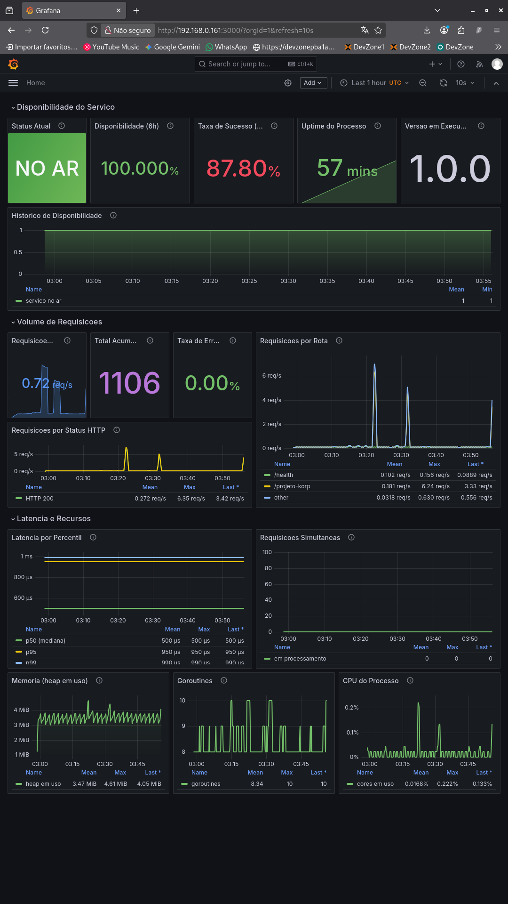

# http-server-projeto-korp

Serviço HTTP em Go, containerizado, com proxy reverso NGINX, observabilidade
via Prometheus e Grafana, e provisionamento completo por Ansible em um único
comando.

Projeto desenvolvido para o desafio técnico de Analista DevOps.

---

## Arquitetura

```
                          host
                           :80
                            │
              ┌─────────────▼──────────────┐
              │  nginx                     │   única porta publicada
              │  proxy reverso → :8080     │
              └─────────────┬──────────────┘
                            │
    ════════════════════════╪════════════════════  rede bridge korp-net
                            │
              ┌─────────────▼──────────────┐
              │  http-server-projeto-korp  │   sem portas expostas ao host
              │  :8080                     │
              │  GET /projeto-korp         │
              │  GET /health  GET /ready   │
              │  GET /metrics              │
              └─────────────┬──────────────┘
                            │ scrape a cada 15s
              ┌─────────────▼──────────────┐
              │  prometheus :9090          │
              └─────────────┬──────────────┘
                            │ query
              ┌─────────────▼──────────────┐
              │  grafana :3000             │   datasource e dashboard
              └────────────────────────────┘   provisionados como código
```

O único caminho de entrada do tráfego é o NGINX. A aplicação não publica
portas no host — fica acessível apenas de dentro da rede `korp-net`, para o
proxy e para o Prometheus.

O ambiente foi validado provisionando uma **VM Debian 13 remota via SSH**, a
partir de um control node separado. O playbook não assume conexão local: as
mesmas roles funcionam contra `localhost` ou contra um servidor remoto,
bastando ajustar o inventário.

---

## Estrutura do repositório

```
.
├── app/                              aplicação Go
│   ├── main.go                       servidor, rotas, shutdown gracioso
│   ├── internal/handlers/            endpoints + testes unitários
│   ├── internal/metrics/             instrumentação Prometheus
│   ├── cmd/healthcheck/              binário auxiliar do HEALTHCHECK
│   └── Dockerfile                    build multi-stage → distroless
│
├── docker/
│   ├── docker-compose.yml            os 4 containers da stack
│   ├── nginx/conf.d/
│   │   └── http-server-projeto-korp.conf    proxy reverso
│   ├── prometheus/
│   │   ├── prometheus.yml            configuração de scrape
│   │   └── alerts.yml                regras de alerta
│   └── grafana/
│       ├── build_dashboard.py        gerador do dashboard (JSON como código)
│       └── provisioning/
│           ├── datasources/datasources.yml
│           └── dashboards/
│               ├── dashboards.yml
│               └── http-server-projeto-korp-dashboard.json
│
├── ansible/
│   ├── site.yml                      playbook principal
│   ├── inventory/hosts.ini
│   ├── group_vars/all.yml
│   └── roles/
│       ├── docker/                   instala e configura o Docker Engine
│       ├── korp_stack/               rede, build, configs, containers
│       └── validate/                 requisição HTTP + saída no console
│
├── docs/img/                         capturas do dashboard
├── preflight.sh                      checa pré-condições antes do deploy
├── verify.sh                         aceite contra os requisitos do desafio
└── Makefile                          atalhos (`make help`)
```

---

## Pré-requisitos

**No control node** (a máquina de onde você roda o Ansible):

- Ansible Core >= 2.15 — a role do Docker usa `deb822_repository`
- Coleções: `make deps`
- Go 1.22+ apenas para rodar os testes localmente (a build acontece no container)

**No host alvo:** Python 3, acesso SSH por chave e sudo. O Docker é instalado
pelo próprio playbook, a partir do repositório oficial.

Distribuições suportadas: família Debian (Debian 11/12/13, Ubuntu 22.04/24.04)
e família RedHat (Rocky, Alma, CentOS Stream). O playbook lê o codename da
distribuição dos facts do Ansible e monta a URL do repositório do Docker de
acordo, então trocar de distro dentro dessas famílias não exige alteração.

---

## Execução

### Provisionamento completo (o comando único do desafio)

```bash
make tidy      # gera o go.sum (só na primeira vez)
make deps      # instala as coleções Ansible
make deploy    # provisiona tudo
```

O alvo `deploy` executa `ansible-playbook site.yml`, que instala o Docker,
cria a rede bridge, constrói a imagem, sobe os quatro containers, configura
o proxy reverso e o monitoramento, e termina fazendo uma requisição HTTP de
validação com a resposta impressa no console.

### Escolhendo o alvo

Edite `ansible/inventory/hosts.ini`:

```ini
[korp]
korp-devops ansible_host=192.168.0.161 ansible_user=korp ansible_ssh_private_key_file=~/.ssh/id_ed25519_korp

[korp:vars]
ansible_python_interpreter=/usr/bin/python3
```

Para provisionar a própria máquina, troque a linha do host por
`localhost ansible_connection=local`. As roles são idênticas nos dois casos.

### Sem Ansible (só Docker)

```bash
make up      # cria a rede e sobe a stack
make smoke   # roda o teste do desafio
```

---

## Verificação

O projeto traz dois scripts que separam pré-condições de pós-condições.

### `preflight.sh` — antes de provisionar

```bash
./preflight.sh
```

48 verificações: versão do Ansible e coleções, integridade do repositório,
conectividade SSH e sudo, sistema operacional e recursos do alvo, sincronia
de relógio via NTP, portas livres, e — o mais importante — **resolução DNS e
alcance HTTPS aos quatro registries usados na build** (`download.docker.com`,
`registry-1.docker.io`, `gcr.io` e `proxy.golang.org`).

Testar só um registry não basta: a build puxa a imagem base do Docker Hub, a
imagem final do gcr.io e os módulos Go do proxy.golang.org. Um bloqueio em
qualquer um deles quebraria o deploy no meio, com uma mensagem de erro que
não aponta para a causa.

### `verify.sh` — depois de provisionar

```bash
./verify.sh
```

32 verificações mapeadas item a item no enunciado. Cada uma imprime qual
requisito está comprovando, incluindo os fáceis de esquecer: que a aplicação
**não** publica portas no host, que a imagem do NGINX é a oficial, que o
volume está exatamente em `/etc/nginx/conf.d/`, que a rede usa driver
`bridge`, e que o horário muda entre duas requisições **e** confere com o
relógio real.

### Idempotência e reprodutibilidade

São coisas diferentes e vale demonstrar as duas:

| Demonstração | Como | O que prova |
|---|---|---|
| Idempotência | `make deploy` duas vezes seguidas | a segunda termina com `changed=0` |
| Reprodutibilidade | restaurar snapshot da VM limpa + `make deploy` | reconstrói o ambiente inteiro do zero |

---

## Dashboard



Os três sinais de disponibilidade contam histórias diferentes ao mesmo tempo.
Na captura acima: `up` indica que o alvo responde ao scrape, a média de 6h
mostra 100% de tempo no ar, e a taxa de sucesso em 87,80% revela que parte do
tráfego recebeu erro.

Um serviço pode estar `up` e ainda assim falhar para o cliente. É por isso
que os três existem.

O JSON do dashboard é **gerado por script**, não exportado da interface. O
`docker/grafana/build_dashboard.py` produz o arquivo de forma determinística
e comentada, o que torna as 37 KB de configuração legíveis e revisáveis em
pull request:

```bash
cd docker/grafana && ./build_dashboard.py
```

---

## Métricas expostas

Ambas as métricas obrigatórias do desafio estão cobertas.

### Disponibilidade

Abordada por três ângulos complementares:

| Sinal | Origem | O que responde |
|-------|--------|----------------|
| `up{job="http-server-projeto-korp"}` | gerada pelo Prometheus a cada scrape | O alvo respondeu? |
| taxa de respostas 2xx/3xx | derivada de `korp_http_requests_total` | O serviço está funcionando *para o cliente*? |
| `korp_uptime_seconds` | aplicação | Houve restart recente / crash loop? |

Os três juntos existem porque cada um tem um ponto cego. `up` não enxerga um
serviço que responde 500 para todo mundo. A taxa de sucesso não distingue
"sem tráfego" de "tudo ok". E o uptime pega crash loops rápidos demais para o
`up` registrar entre dois scrapes.

### Volume de requisições

`korp_http_requests_total{method, path, status}` — counter, o tipo correto
para contagem monotônica. `rate()` e `increase()` tratam corretamente o reset
que ocorre quando o processo reinicia.

### Demais métricas

| Métrica | Tipo | Uso |
|---------|------|-----|
| `korp_http_request_duration_seconds` | histogram | latência por percentil |
| `korp_http_requests_in_flight` | gauge | concorrência instantânea |
| `korp_service_healthy` | gauge | saúde reportada pela aplicação |
| `korp_build_info` | gauge (info) | versão/commit em execução |
| `go_*`, `process_*` | vários | memória, GC, goroutines, CPU |

### Consultas PromQL úteis

```promql
# disponibilidade percentual nas últimas 6 horas
avg_over_time(up{job="http-server-projeto-korp"}[6h]) * 100

# requisições por segundo, por rota
sum by (path) (rate(korp_http_requests_total[5m]))

# taxa de erro 5xx (or vector(0) evita "No data" quando não há 5xx)
(sum(rate(korp_http_requests_total{status=~"5.."}[5m])) or vector(0))
  / clamp_min(sum(rate(korp_http_requests_total[5m])), 0.0001)

# latência p95
histogram_quantile(0.95,
  sum by (le) (rate(korp_http_request_duration_seconds_bucket[5m])))
```

---

## Decisões técnicas

### Aplicação

**Biblioteca padrão, sem framework web.** O serviço tem quatro rotas. Gin ou
Echo trariam dependências, superfície de ataque e uma camada de abstração sem
ganho real nessa escala. `net/http` cobre tudo.

**Horário resolvido a cada requisição.** `time.Now().UTC().Format(time.RFC3339)`
é chamado dentro do handler, nunca em inicialização. O `.UTC()` garante o
mesmo resultado independente do timezone do container ou do host. Há um teste
que congela o relógio em `-03:00` e confirma a conversão, e outro que compara
duas requisições consecutivas para provar que o valor não está sendo cacheado.

**Injeção do relógio.** O handler recebe `Now func() time.Time` em vez de
chamar `time.Now()` direto. Isso torna o comportamento temporal testável sem
`sleep`.

**Shutdown gracioso.** O processo trata SIGTERM (o sinal que `docker stop`
envia) e chama `srv.Shutdown()`, drenando as conexões em voo antes de sair.
Sem isso, toda atualização derruba requisições no meio.

**Timeouts explícitos no servidor.** `ReadHeaderTimeout`, `ReadTimeout`,
`WriteTimeout` e `IdleTimeout` definidos. O padrão do Go é "sem limite", o
que permite que uma conexão lenta segure um handler indefinidamente
(Slowloris).

### Cardinalidade das métricas

O label `path` recebe **o padrão da rota registrada**, não `r.URL.Path`.
Rotas desconhecidas são agrupadas em `other`.

Isso não é detalhe estético. Usando a URL crua, qualquer cliente poderia
gerar séries temporais infinitas batendo em `/a`, `/b`, `/c`... Cada
combinação de labels vira uma série no Prometheus, e explosão de
cardinalidade é uma das formas mais comuns de derrubar um Prometheus em
produção.

Pelo mesmo motivo o endpoint `/metrics` fica fora do middleware de
instrumentação: contar o scrape do Prometheus como tráfego do serviço
poluiria a métrica de volume.

### Imagem Docker

**Multi-stage com runtime distroless.** O estágio de build usa
`golang:1.22-alpine`; o final é `gcr.io/distroless/static-debian12:nonroot`,
que contém apenas certificados CA, timezone e `/etc/passwd`. Sem shell, sem
gerenciador de pacotes, sem coreutils — não há binários para um invasor
reutilizar após um comprometimento. **A imagem final tem 5,9 MB.**

**Ordem das camadas.** `go.mod`/`go.sum` são copiados antes do código-fonte,
então o download das dependências fica em cache enquanto os manifests não
mudarem, mesmo que todo o código tenha mudado.

**Testes dentro do build.** `go vet` e `go test` rodam no estágio de build.
Uma imagem só é produzida se a suíte passar.

**Binário de healthcheck próprio.** Como não há curl nem wget no distroless,
compilamos um segundo binário Go minúsculo usado pela instrução
`HEALTHCHECK`. A alternativa seria carregar uma imagem Alpine inteira em
produção só para ter o wget.

**Build reproduzível.** `-trimpath` remove caminhos da máquina de build;
`-ldflags="-s -w"` descarta símbolos e debug info; `CGO_ENABLED=0` produz um
binário estático. Versão e commit são injetados via `-X`.

**Forma exec no ENTRYPOINT.** Array, não string. Assim o processo é PID 1 de
verdade e recebe o SIGTERM diretamente, o que faz o shutdown gracioso
funcionar.

### Rede e Compose

**Rede declarada como `external: true`.** Ela é criada pelo Ansible, não pelo
Compose — exatamente como o item 3 do desafio pede. Isso também desacopla o
ciclo de vida da rede do ciclo de vida da stack.

**A aplicação não publica portas.** Não existe seção `ports` no serviço
`http-server-projeto-korp`, por exigência do desafio. A porta 8080 é
alcançável apenas de dentro de `korp-net`.

**`depends_on` com `condition: service_healthy`.** O NGINX resolve os
hostnames do upstream na inicialização. Se subir antes da aplicação existir,
falha com `host not found in upstream` e não se recupera sozinho. A condição
de saúde garante a ordem correta.

**Healthchecks apontam para `127.0.0.1`, nunca `localhost`.** Ver a seção
"Problemas encontrados" abaixo — foi um bug real neste projeto.

**Endurecimento dos containers.** `no-new-privileges`, `cap_drop: ALL`,
`read_only` no filesystem da aplicação, limites de CPU e memória, e rotação
de log configurada (`max-size` + `max-file`) — disco cheio por log de
container é um incidente clássico.

### NGINX

**`/metrics` bloqueado na borda.** O Prometheus está na mesma rede e fala
direto com o container na porta 8080, sem passar pelo proxy. Então não há
razão para expor as métricas publicamente: elas revelam volume de tráfego,
rotas internas e versão do binário.

**Headers de encaminhamento.** Sem `X-Forwarded-For` e `X-Real-IP`, a
aplicação enxergaria o IP interno do container do NGINX como origem de todo
o tráfego.

**`keepalive` no upstream.** Mantém conexões TCP abertas com o backend em vez
de reabrir a cada requisição. Exige HTTP/1.1 e `Connection ""` no location.

**Rate limiting.** 10 req/s por IP com burst de 20.

### Ansible

**Roles separadas por responsabilidade.** `docker` (instalação),
`korp_stack` (deploy) e `validate` (verificação) são independentes e
reutilizáveis. Tags permitem rodar etapas isoladas durante o
desenvolvimento: `--tags validate`.

**Repositório oficial do Docker,** não o pacote `docker.io` das distros —
traz o plugin `docker-compose-v2` e versões atualizadas. A chave GPG é
adicionada com `signed-by`, restrita a esse repositório, em vez de ir para o
chaveiro global. O repositório é declarado com `deb822_repository`, que
substitui o `apt_repository` deprecado.

**`docker_image_build` em vez de `docker_image`.** O primeiro usa
`docker buildx` (BuildKit); o segundo fala com a API clássica do Engine, cujo
builder legado não suporta `RUN --mount=type=cache`. Ver "Problemas
encontrados".

**Verificação de versão do SDK Python.** Não basta instalar `python3-docker`:
o pacote da distro pode ser antigo demais para a coleção `community.docker`.
O playbook consulta a versão que o Python realmente enxerga e recorre ao pip
(com `--break-system-packages`, o escape oficial para o PEP 668) apenas
quando necessário.

**A estrutura no host alvo espelha a do repositório.** `/opt/projeto-korp/app`
e `/opt/projeto-korp/docker/...`, de modo que todos os caminhos relativos do
compose resolvem igual dos dois lados. Como efeito colateral útil, dá para
entrar na VM e rodar `cd /opt/projeto-korp/docker && docker compose ps`
exatamente como se faria localmente.

**Idempotência.** Handlers só disparam quando algo realmente muda; o
`nginx -s reload` recarrega a configuração sem derrubar conexões, e o
Prometheus recarrega via `POST /-/reload`. Uma segunda execução do playbook
reporta `changed=0`.

**Validação que realmente valida.** A role `validate` não se contenta com
HTTP 200: confere o campo `nome`, valida o formato do horário com regex
exigindo o sufixo `Z` (UTC), faz duas requisições **com 2 segundos de
intervalo** para provar que o valor é dinâmico, verifica que `/metrics` está
bloqueado na borda, e confirma que o datasource e o dashboard foram
provisionados no Grafana.

O intervalo importa: o RFC3339 tem precisão de segundo, então duas
requisições imediatas devolveriam a mesma string mesmo com a implementação
correta. Sem a pausa, o teste seria inconclusivo — e um teste que não pode
falhar de verdade não testa nada.

As requisições rodam **no host alvo** (os módulos `uri` e `wait_for` executam
no managed node), então apontar para `localhost:80` reproduz literalmente o
`curl http://localhost:80/projeto-korp` do enunciado.

### Grafana

Datasource e dashboard nascem prontos, por arquivos de provisionamento —
o item bônus do desafio. O `uid` do datasource é fixo (`prometheus-korp`)
porque o JSON do dashboard o referencia; sem fixar, o Grafana geraria um uid
aleatório e os painéis ficariam órfãos.

---

## Problemas encontrados e resolvidos

Quatro bugs reais apareceram durante o provisionamento. Estão documentados
porque o raciocínio de diagnóstico importa tanto quanto o resultado.

### 1. `--mount` requer BuildKit

**Sintoma:** o playbook falhava no `Step 5/20` com
`the --mount option requires BuildKit`.

**Causa:** o Dockerfile usa `RUN --mount=type=cache` para cachear os módulos
Go, sintaxe exclusiva do BuildKit. O módulo `community.docker.docker_image`
conversa com a API clássica do Docker Engine, cujo builder legado é de 2013 e
não entende `--mount`.

**Detalhe que engana:** na linha de comando o mesmo Dockerfile funciona,
porque desde o Docker 23 o `docker build` já usa buildx por padrão. A
diferença só aparece pela API — exatamente o tipo de armadilha que surge ao
automatizar algo que funcionava manualmente.

**Correção:** trocar para `community.docker.docker_image_build`, que invoca
`docker buildx build`.

### 2. Contexto de build apontando para fora

**Sintoma:** latente, ainda não tinha se manifestado.

**Causa:** o `docker-compose.yml` declara `build.context: ../app`. No
repositório o compose fica em `docker/`, então `../app` resolve corretamente.
Mas a role copiava o compose para a **raiz** de `/opt/projeto-korp/`, onde
`../app` vira `/opt/app` — inexistente.

Não quebrou de imediato porque a imagem é construída em uma task separada e o
compose apenas a reutiliza. Quebraria no primeiro `docker compose up --build`
executado na VM.

**Correção:** espelhar a estrutura do repositório no host alvo.

### 3. NGINX saudável, healthcheck falhando

**Sintoma:** `container nginx-projeto-korp is unhealthy`, mas
`curl http://localhost:80/projeto-korp` respondia normalmente.

**Diagnóstico:** dentro do container, `wget http://127.0.0.1/nginx-health`
funcionava e `wget http://localhost/nginx-health` falhava com
`Connection refused`.

A mensagem foi decisiva: recusa significa que o pacote chegou e não havia
ninguém escutando — se fosse resolução de nome, seria "bad address". O
`/etc/hosts` do container mapeia `localhost` para `127.0.0.1` **e** para
`::1`, e o NGINX com `listen 80` faz bind apenas em IPv4.

Prometheus e Grafana passavam no mesmo teste por serem escritos em Go, que
faz bind dual-stack por padrão. Mesma imagem base, mesmo `wget`,
comportamento diferente por causa da linguagem do servidor.

**Correção:** fixar `127.0.0.1` em todas as sondas, não só na que quebrou —
corrigir a classe do problema em vez do sintoma isolado.

### 4. Painéis do Grafana sem valor

**Sintoma:** todos os painéis de série temporal funcionavam; todos os painéis
`stat` ficavam em branco. Alguns exibiam o sparkline mas nenhum número.

**Causa:** o identificador do redutor estava escrito como `lastNonNull`. O
nome correto no Grafana é `lastNotNull`. Qualquer outra string é ignorada
silenciosamente e o painel não produz valor.

**Por que o sintoma confundia:** o sparkline desenha a série crua, sem passar
pelo redutor. Dois caminhos independentes dentro do mesmo painel, e só um
quebrado — o que fez parecer problema de renderização de texto.

**A pista estava na própria tela:** as legendas dos painéis de série temporal
mostravam a coluna "Last \*" com valores. Ali o identificador estava correto.
Bastava comparar as duas grafias no mesmo arquivo.

**Lição aplicável:** quando parte de um componente funciona e parte não,
compare os dois caminhos internos antes de mexer na configuração externa.

---

## Limitações conhecidas

Escolhas conscientes de escopo, não descuidos:

- **`sudo` sem senha para o usuário de automação.** O enunciado pede
  provisionamento com um único comando; com senha, seria preciso `-K`.
  Mitigações: usuário dedicado exclusivamente à automação, host de
  laboratório isolado em VLAN própria, acesso SSH apenas por chave dedicada,
  sem exposição externa. Em produção: escopo restrito de comandos no
  `sudoers` ou credencial em cofre.
- **Credenciais do Grafana em texto plano.** `admin`/`admin` via variável de
  ambiente. Em produção isso viria de `ansible-vault`, Vault ou SSM.
- **Sem TLS.** O desafio pede HTTP na porta 80. Em produção o NGINX
  terminaria TLS com certificado do Let's Encrypt.
- **Sem Alertmanager.** As regras de alerta existem e ficam visíveis em
  `/alerts`, mas não há roteamento de notificação.
- **Prometheus com armazenamento local,** retenção de 15 dias. Para
  retenção longa, `remote_write` para Thanos ou Mimir.
- **Instância única.** Sem alta disponibilidade nem balanceamento.

---

## Roadmap

O que eu faria com mais tempo, em ordem de prioridade:

1. **Role de hardening** — `PasswordAuthentication no` no sshd (com
   `validate: sshd -t -f %s` para nunca escrever config quebrada) e
   `authorized_key` com `exclusive: true`, garantindo que só a chave de
   automação tenha acesso mesmo após um rollback
2. **Pipeline de CI** — lint, testes, build da imagem e scan de
   vulnerabilidades (Trivy) a cada push
3. **Credenciais em `ansible-vault`**, eliminando senhas do repositório
4. **Provisionamento da VM com Terraform/OpenTofu** — infraestrutura e
   configuração ambas como código
5. **Alertmanager** com notificação real
6. **Testes de integração** subindo a stack completa via Testcontainers

---

## Comandos

```
make help       lista todos os alvos
make tidy       gera o go.sum
make test       roda os testes unitários
make deps       instala as coleções Ansible
make check      valida a sintaxe do playbook
make deploy     provisiona o ambiente inteiro
make up         sobe a stack só com Docker
make smoke      executa o teste do desafio
make load       gera tráfego para o dashboard
make destroy    remove tudo

./preflight.sh  verifica pré-condições antes do deploy
./verify.sh     verifica o resultado contra os requisitos
```
